# Financial Organization App - Core Financial Logic

## Overview

This document explains the core financial calculations and business logic of the Financial Organization application, including how dividends, profits, shares, loans, investments, and reserves interact within the system to create a sustainable financial ecosystem.

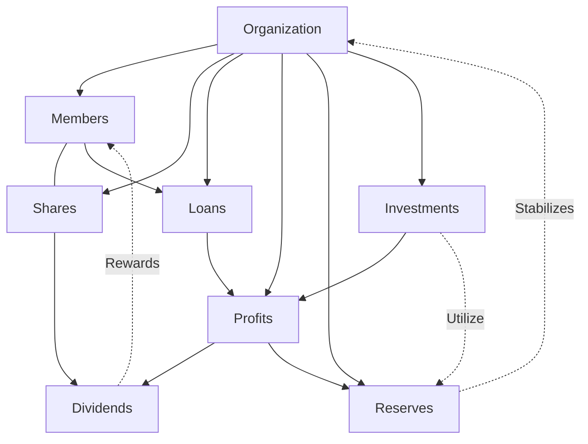

## Core Financial Components

### 1. Shares

Shares represent ownership in the organization. Each member can own a certain number of shares, either through direct purchase or as bonus shares earned through consistent participation.

#### Share Calculation

- **Total Shares** = Sum of all shares owned by members
- **Share Value** = Total Organization Net Worth / Total Shares
- **Member Ownership %** = Member's Shares / Total Shares

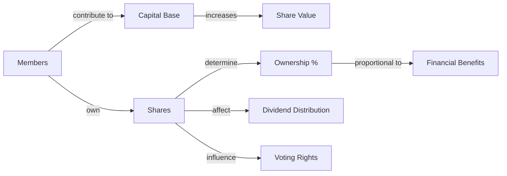

### 2. Capital Contributions

Members contribute to the organization's capital base through:

- **Share Purchases**: Direct investment in organization shares
- **Regular Savings**: Scheduled deposits into member accounts
- **Special Contributions**: One-time contributions for specific projects

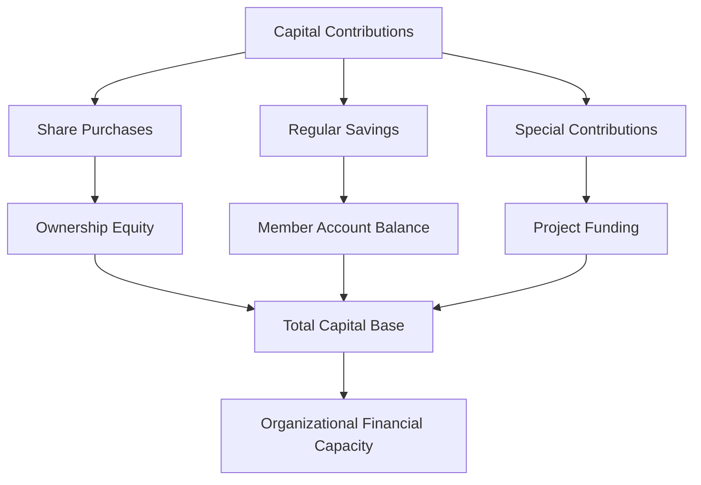

### 3. Profits

Profits are calculated on a quarterly basis from the organization's income streams and expenses.

#### Profit Calculation

- **Quarterly Profit** = Total Income - Total Expenses
- **Annual Profit** = Sum of Quarterly Profits
- **Profit Allocation** = Dividends + Reserves + Reinvestment

#### Income Sources
- Loan interest payments
- Investment returns
- Membership fees
- Service charges
- Late payment penalties

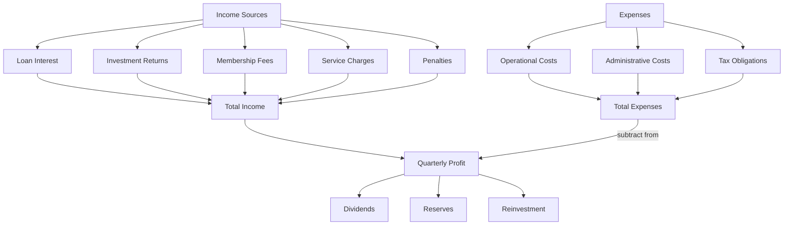

### 4. Dividends

Dividends are portions of profit distributed to members based on their financial contributions to the organization.

#### Proportional Dividend Calculation System

- **Base Dividend Rate** = Automatically calculated based on organization's total assets:
  - Default rate: 8.5%
  - For organizations with total assets > Rs. 1,000,000: 10.0%
  - For organizations with total assets > Rs. 500,000: 9.0%
  - For organizations with total assets < Rs. 100,000: 7.0%

- **Dividend Pool** = Quarterly Profit × Base Dividend Rate 
- **Organization Total Assets** = Cash Contributions + Bank Balances + Outstanding Loans + Investments
- **Member's Asset Proportion** = Member's Total Assets / Organization Total Assets
- **Individual Base Dividend** = Dividend Pool × Member's Asset Proportion
- **Loyalty Multiplier** = Based on membership tenure (increases by 0.5% every 5 years)
- **Final Individual Dividend** = Individual Base Dividend × (1 + Loyalty Multiplier)

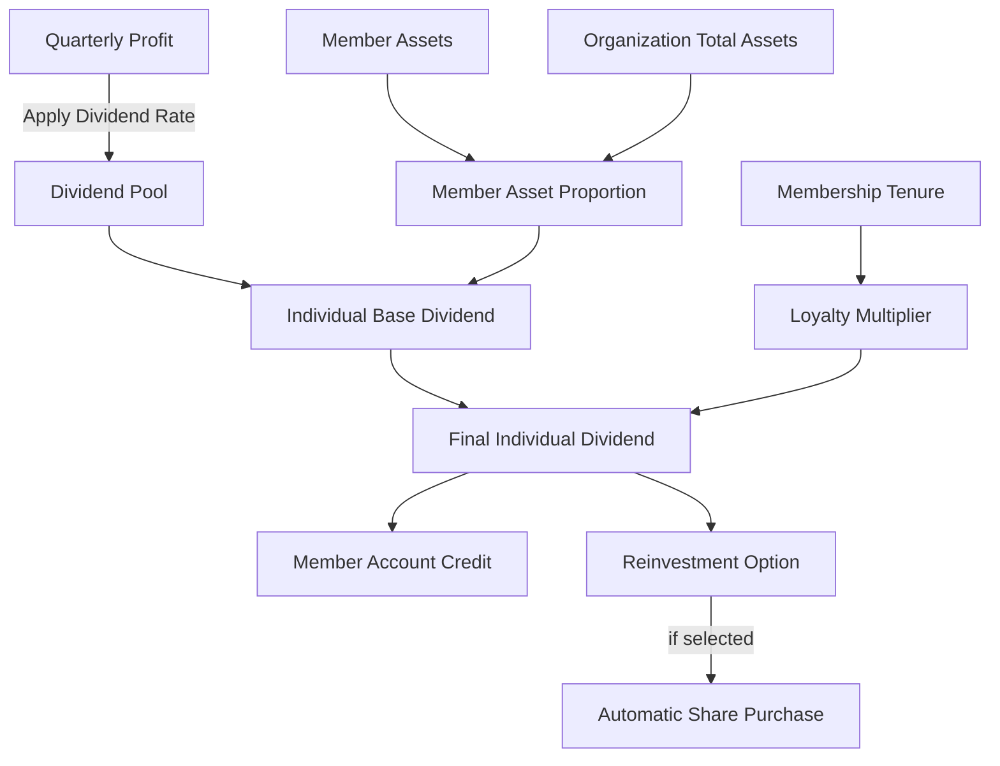

### 5. Loans

Loans are issued to members based on their eligibility, risk assessment, and the organization's available funds.

#### Loan Products

- **Emergency Loans**: Small, short-term loans with expedited processing
- **Personal Loans**: Medium-term loans for personal needs
- **Business Loans**: Larger loans for entrepreneurial activities
- **Education Loans**: Special-purpose loans with favorable terms for education

#### Loan Calculation

- **Interest Rate** = Base Rate + Risk Premium - Tenure Discount
  - Base Rate: Standard interest rate (e.g., 12%)
  - Risk Premium: Based on member's risk score (0-5%)
  - Tenure Discount: Reduction based on membership duration (0-2%)

- **Interest Amount** = Loan Principal × Effective Interest Rate × Time Period
- **Monthly Payment** = (Principal + Total Interest) / Loan Term in Months
- **Total Repayment** = Principal + Total Interest

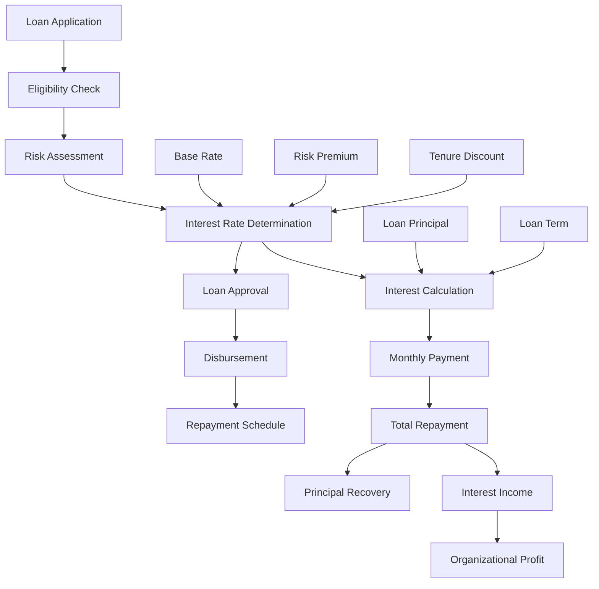

### 6. Investments

The organization maintains a diversified investment portfolio to generate additional income and ensure long-term financial growth.

#### Investment Categories

- **Fixed Deposits**: Low-risk, stable returns (60% of investment funds)
- **Government Bonds**: Medium-risk, reliable returns (25% of investment funds)
- **Mutual Funds**: Higher-risk, potential for greater returns (10% of investment funds)
- **Strategic Investments**: Community development projects (5% of investment funds)

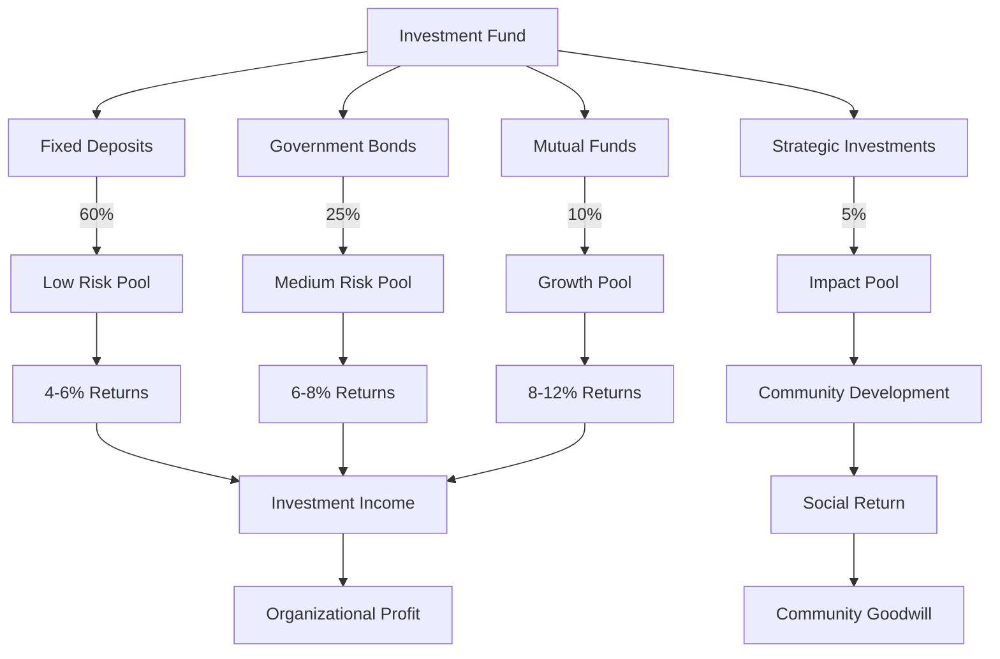

## Financial Workflows

### 1. Comprehensive Financial Cycle

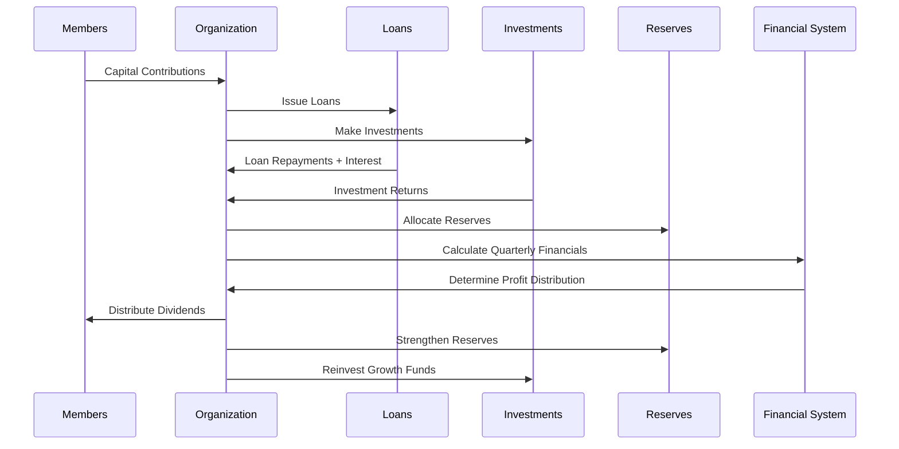

### 2. Loan Lifecycle Management

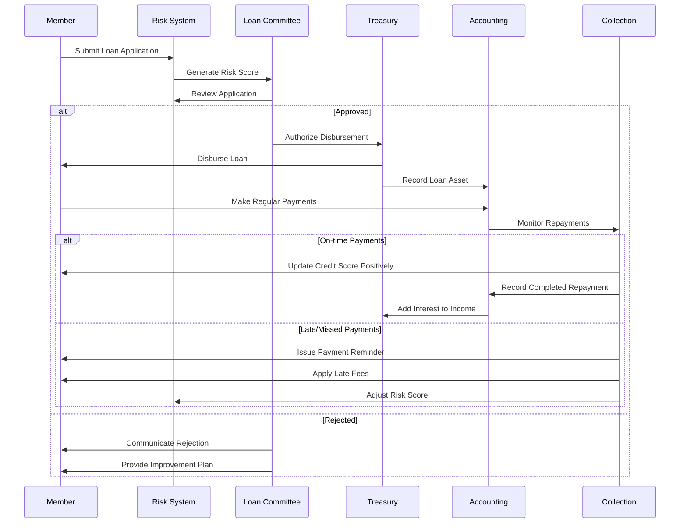

### 3. Dividend Calculation and Distribution Process

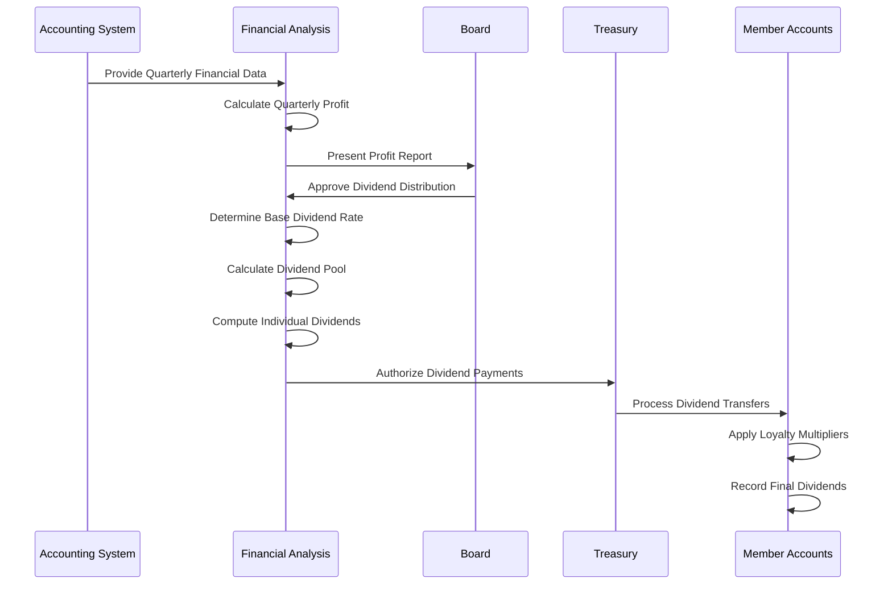

## Risk Management and Financial Safeguards

### 1. Loan Risk Assessment

The organization implements a systematic risk assessment for all loan applications:

#### Enhanced Risk Scoring System
- **Member History Score**: Based on previous loan repayment history (0-40 points)
- **Financial Stability**: Based on income verification and existing financial obligations (0-30 points)
- **Contribution History**: Based on consistency of contributions to the organization (0-20 points)
- **Collateral/Security**: Additional security provided for the loan (0-10 points)
- **Purpose Alignment**: How well the loan purpose aligns with organizational values (0-10 points)

#### Dynamic Interest Rate Determination

The system automatically adjusts interest rates based on the risk score, providing fairer terms while maintaining organizational financial health:

- **Low Risk (85-100 points)**: Base Rate - 2%
- **Medium-Low Risk (70-84 points)**: Base Rate - 1%
- **Standard Risk (55-69 points)**: Base Rate
- **Medium-High Risk (40-54 points)**: Base Rate + 1%
- **High Risk (25-39 points)**: Base Rate + 2%
- **Very High Risk (<25 points)**: Base Rate + 3% or Application Denial

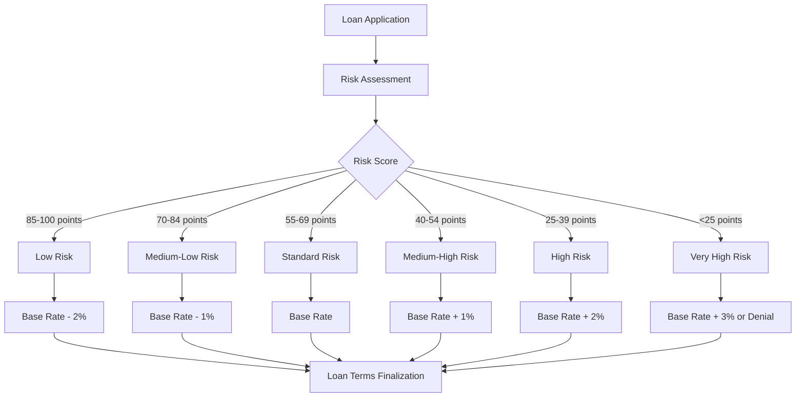

### 2. Tiered Reserve System

To ensure financial resilience, the organization maintains a multi-tiered reserve system:

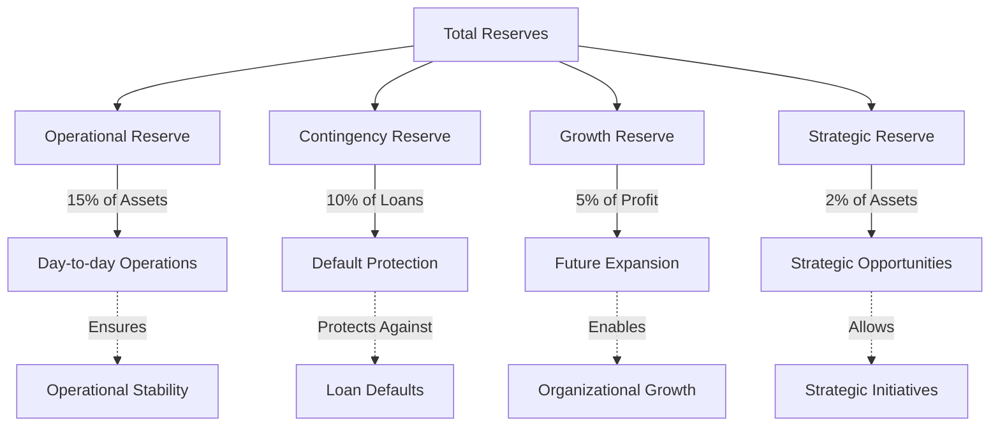

### 3. Comprehensive Dividend Enhancement Program

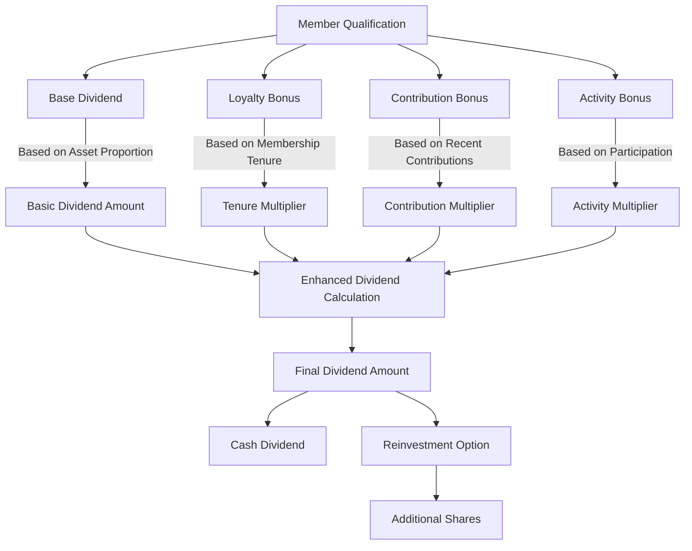

## Example Calculations

### Advanced Dividend Calculation Example

Given:
- Quarterly Profit: Rs. 150,000
- Organization Total Assets: Rs. 2,000,000
- Base Dividend Rate: 10.0%
- Member A:
  - Total Assets: Rs. 300,000 (15% of organization)
  - Membership Tenure: 12 years (1.0% loyalty bonus)
  - Recent Contribution Increase: 20% (0.5% bonus)
  - Active Participation: Yes (0.2% bonus)
- Member B:
  - Total Assets: Rs. 100,000 (5% of organization)
  - Membership Tenure: 3 years (0% loyalty bonus)
  - Recent Contribution Increase: 5% (0% bonus)
  - Active Participation: No (0% bonus)

Calculations:
1. Dividend Pool = Rs. 150,000 × 10.0% = Rs. 15,000
2. Member A:
   - Base Dividend = Rs. 15,000 × 0.15 = Rs. 2,250
   - Total Multiplier = 1 + 0.01 + 0.005 + 0.002 = 1.017
   - Final Dividend = Rs. 2,250 × 1.017 = Rs. 2,288.25
3. Member B:
   - Base Dividend = Rs. 15,000 × 0.05 = Rs. 750
   - Total Multiplier = 1 + 0 + 0 + 0 = 1.0
   - Final Dividend = Rs. 750 × 1.0 = Rs. 750

### Dynamic Loan Interest Calculation Example

Given:
- Loan Principal: Rs. 100,000
- Base Interest Rate: 12%
- Member Risk Score: 78 points (Medium-Low Risk)
- Loan Term: 24 months

Calculations:
1. Risk-Adjusted Interest Rate = 12% - 1% = 11%
2. Total Interest = Rs. 100,000 × 11% × 2 years = Rs. 22,000
3. Monthly Payment = Rs. 122,000 / 24 = Rs. 5,083.33 per month
4. Total Repayment = Rs. 122,000

## Conclusion

The financial logic of this application creates a self-sustaining ecosystem where multiple financial mechanisms work together:

1. **Member contributions** build the organization's capital base
2. **Loan interest and investments** generate income
3. **Profits** are strategically allocated to dividends, reserves, and growth
4. **Proportional dividends** reward members based on their financial contributions
5. **Risk management systems** protect organizational assets
6. **Reserve requirements** ensure long-term stability

This comprehensive financial framework ensures the organization can:
- Maintain liquidity for operational needs
- Generate sustainable returns for members
- Expand services and reach over time
- Withstand financial challenges and uncertainties
- Provide fair and transparent financial benefits

The integrated financial system creates strong incentives for members to:
1. Increase their financial contributions
2. Maintain long-term membership
3. Participate actively in organizational activities
4. Repay loans responsibly
5. Refer new members to strengthen the collective

Through continuous monitoring of key financial metrics and regular system optimizations, the organization maintains a robust financial foundation that supports both current operations and future growth. 