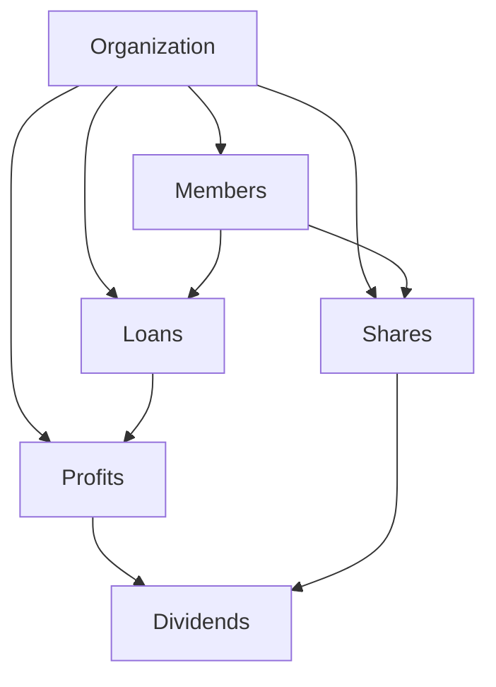
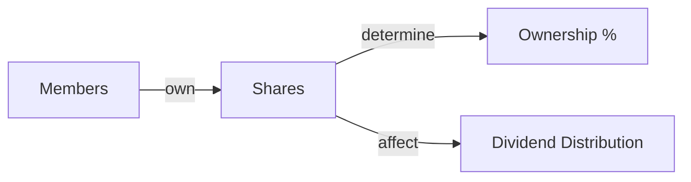
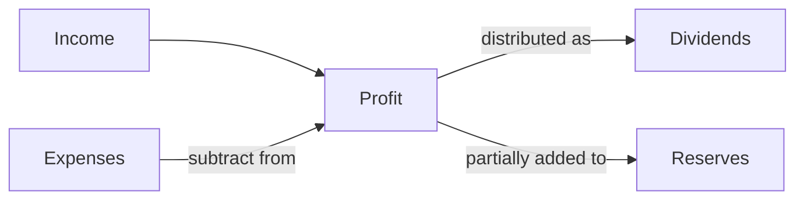
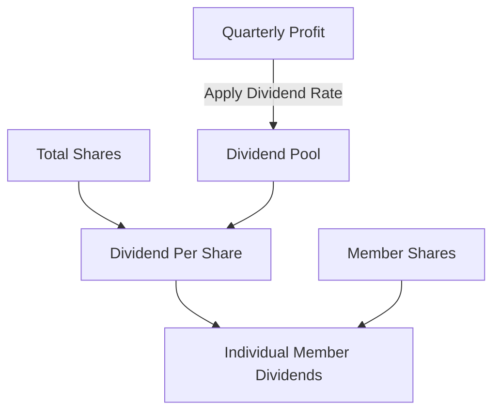
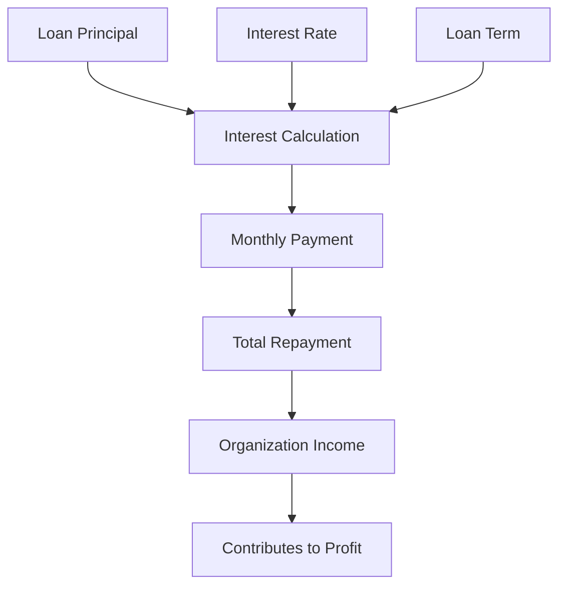
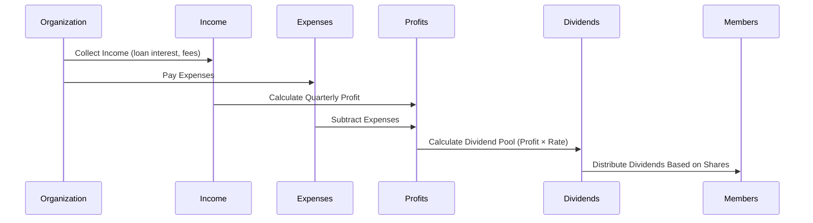
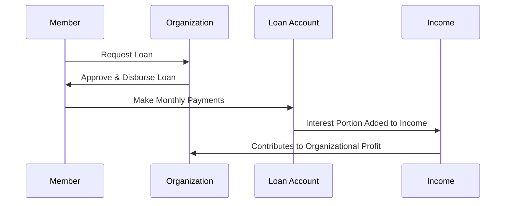
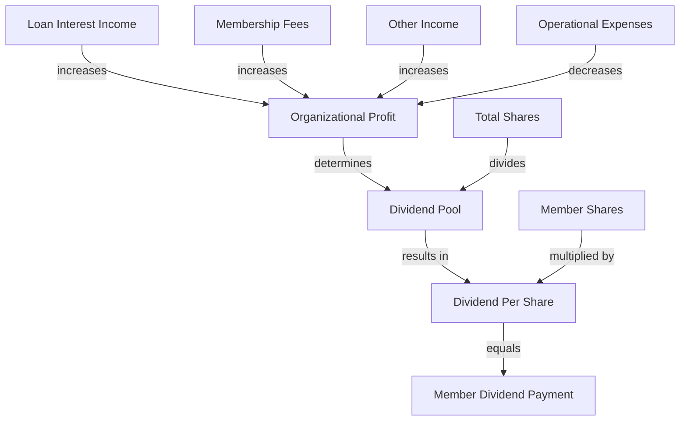

# Financial Organization App - Core Financial Logic

## Overview

This document explains the core financial calculations and business logic of the Financial Organization application, including how dividends, profits, shares, and loans interact within the system.

## Core Financial Components

### 1. Shares

Shares represent ownership in the organization. Each member can own a certain number of shares.

#### Share Calculation

- **Total Shares** = Sum of all shares owned by members
- **Share Value** = Total Organization Net Worth / Total Shares

### 2. Profits

Profits are calculated on a quarterly basis from the organization's income and expenses.

#### Profit Calculation

- **Quarterly Profit** = Total Income - Total Expenses
- **Annual Profit** = Sum of Quarterly Profits

### 3. Dividends

Dividends are portions of profit distributed to members based on their share ownership.

#### Dividend Calculation

- **Dividend Pool** = Quarterly Profit × Dividend Rate (e.g., 8.5%)
- **Dividend Per Share** = Dividend Pool / Total Shares
- **Member Dividend** = Member Shares × Dividend Per Share

### 4. Loans

Loans are issued to members with interest, creating income for the organization.

#### Loan Calculation

- **Interest Amount** = Loan Principal × Interest Rate × Time Period
- **Monthly Payment** = (Principal + Total Interest) / Loan Term in Months
- **Total Repayment** = Principal + Total Interest

## Financial Workflows

### Quarterly Financial Cycle

### Loan Issuance and Repayment

## How These Components Affect Each Other

### 1. Share and Dividend Relationship

The number of shares a member owns directly determines their portion of distributed dividends. More shares means a larger dividend payment.

### 2. Loans and Profit Relationship

Loan interest payments contribute to the organization's income, increasing quarterly profits. Higher profits lead to larger dividend pools.

### 3. Profit and Dividend Rate

The dividend rate (percentage of profit distributed to shareholders) affects how much profit is retained by the organization versus distributed to members.

### 4. System-Wide Financial Health

## Example Calculations

### Dividend Calculation Example

Given:
- Quarterly Profit: Rs. 100,000
- Dividend Rate: 8.5%
- Total Shares: 1,000
- Member A owns 50 shares

Calculations:
1. Dividend Pool = Rs. 100,000 × 8.5% = Rs. 8,500
2. Dividend Per Share = Rs. 8,500 / 1,000 shares = Rs. 8.5 per share
3. Member A's Dividend = 50 shares × Rs. 8.5 = Rs. 425

### Loan Interest Calculation Example

Given:
- Loan Principal: Rs. 50,000
- Annual Interest Rate: 12%
- Loan Term: 12 months

Calculations:
1. Total Interest = Rs. 50,000 × 12% × 1 year = Rs. 6,000
2. Monthly Payment = Rs. 56,000 / 12 = Rs. 4,667 per month
3. Contribution to Income = Rs. 6,000 (over the life of the loan)

## Conclusion

The financial logic of this application creates a self-sustaining ecosystem where loan interest creates income, which generates profits, which are partially distributed as dividends to reward share ownership. This creates incentives for members to both own shares and repay loans on time, contributing to the organization's overall financial health. 