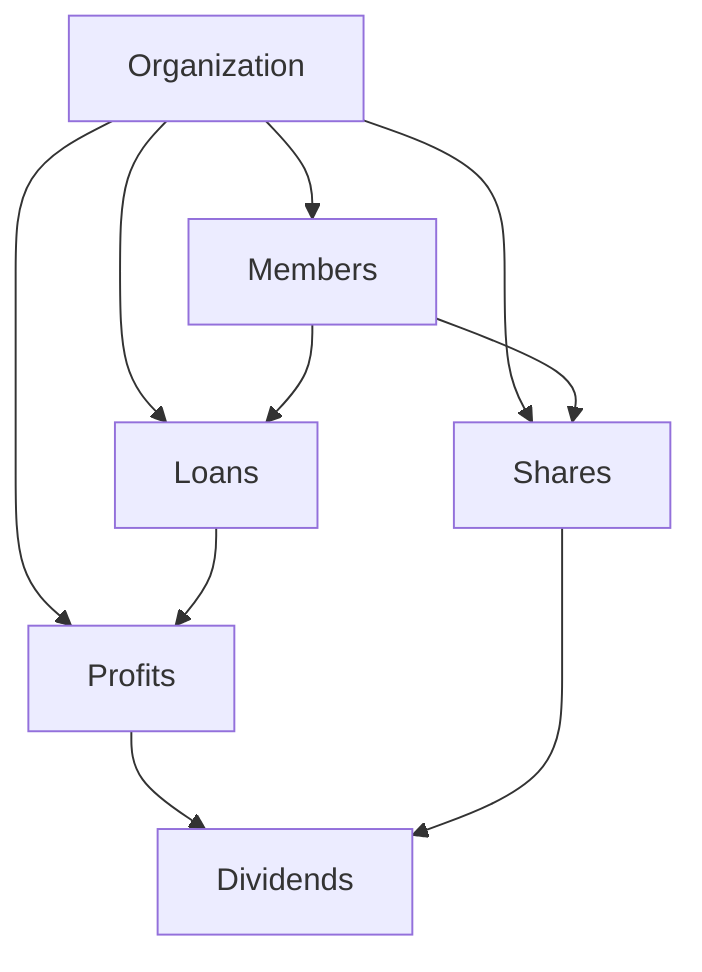
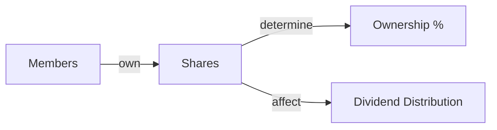
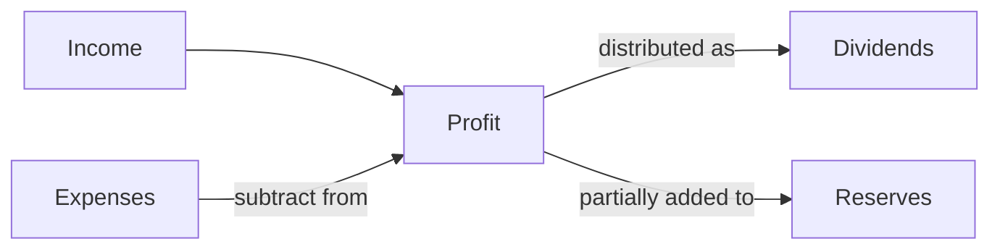
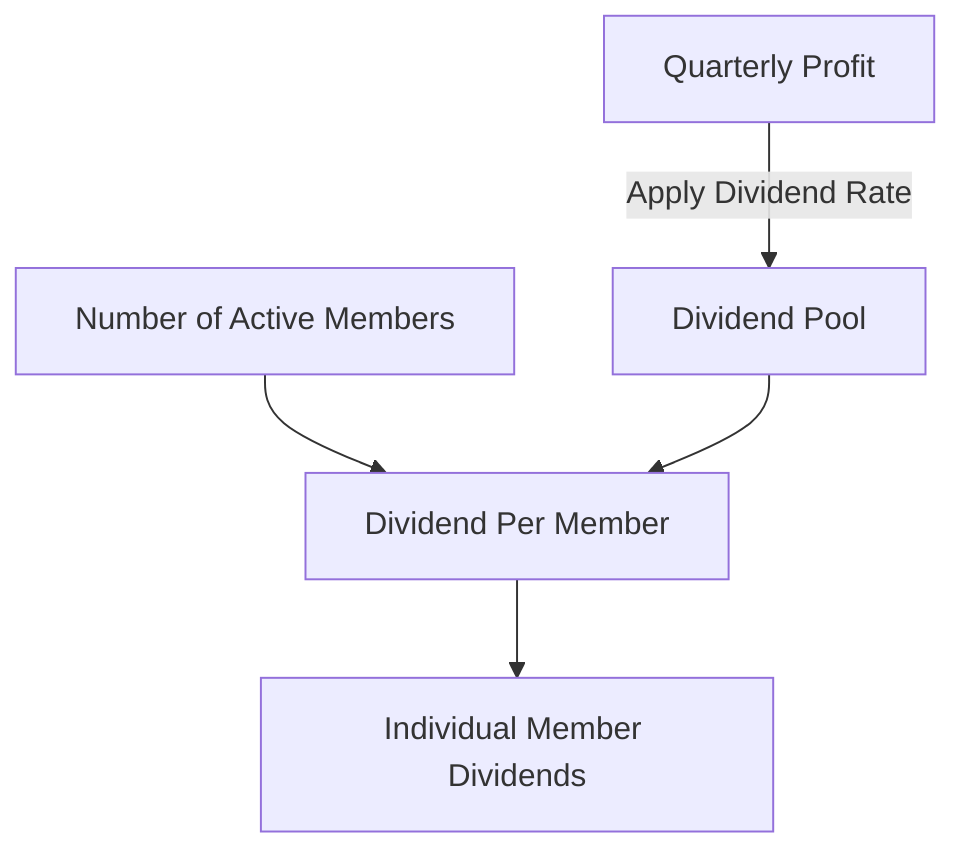
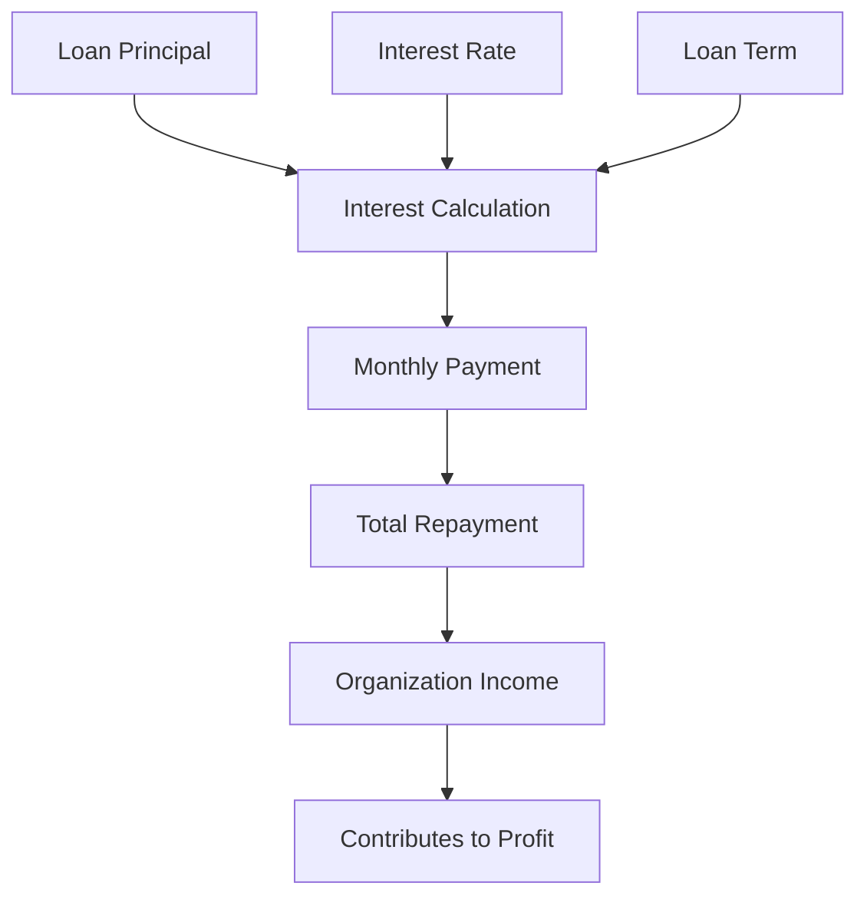
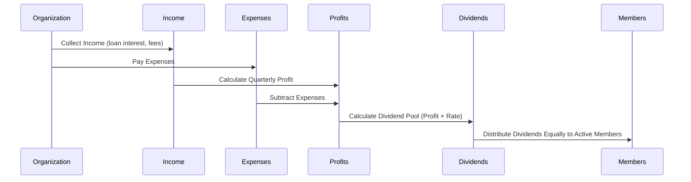
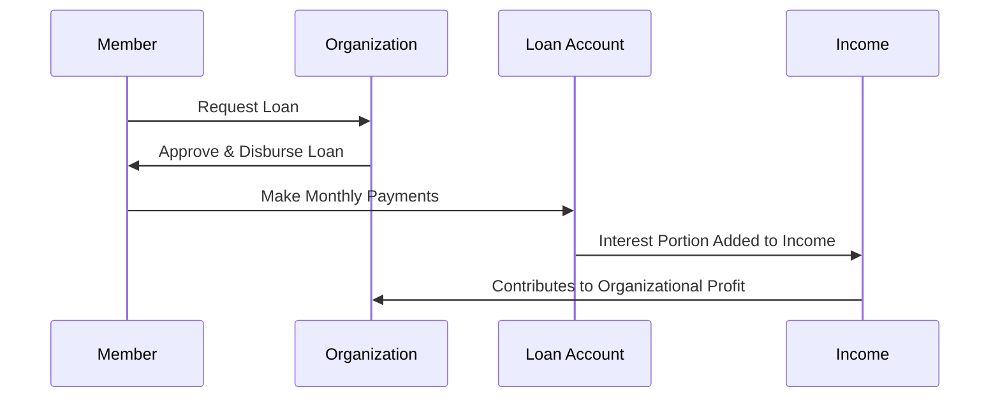
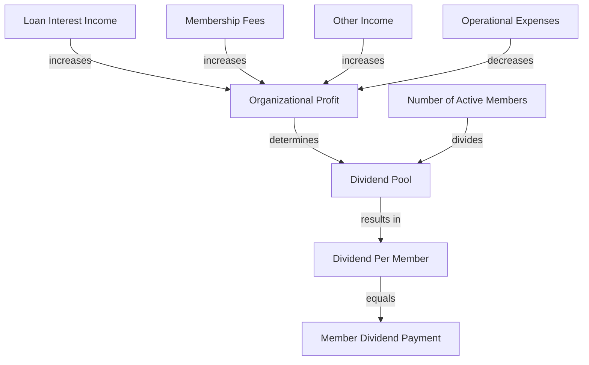

# Financial Organization App - Core Financial Logic

## Overview

This document explains the core financial calculations and business logic of the Financial Organization application, including how dividends, profits, shares, and loans interact within the system.

## Core Financial Components

### 1. Shares

Shares represent ownership in the organization. Each member can own a certain number of shares.

#### Share Calculation

- **Total Shares** = Sum of all shares owned by members
- **Share Value** = Total Organization Net Worth / Total Shares

### 2. Profits

Profits are calculated on a quarterly basis from the organization's income and expenses.

#### Profit Calculation

- **Quarterly Profit** = Total Income - Total Expenses
- **Annual Profit** = Sum of Quarterly Profits

### 3. Dividends

Dividends are portions of profit distributed to members of the organization.

#### Current Dividend Calculation

- **Dividend Pool** = Quarterly Profit × Dividend Rate (e.g., 8.5%)
- **Per Member Dividend** = Dividend Pool / Number of Active Members

This is a simplification of the traditional dividend model where all active members receive an equal share of the profits, regardless of their share ownership.

### 4. Loans

Loans are issued to members with interest, creating income for the organization.

#### Loan Calculation

- **Interest Amount** = Loan Principal × Interest Rate × Time Period
- **Monthly Payment** = (Principal + Total Interest) / Loan Term in Months
- **Total Repayment** = Principal + Total Interest

## Financial Workflows

### Quarterly Financial Cycle

### Loan Issuance and Repayment

## How These Components Affect Each Other

### 1. Members and Dividend Relationship

In the current implementation, all active members receive an equal portion of the dividend pool, which is calculated from the quarterly profit multiplied by the dividend rate.

### 2. Loans and Profit Relationship

Loan interest payments contribute to the organization's income, increasing quarterly profits. Higher profits lead to larger dividend pools.

### 3. Profit and Dividend Rate

The dividend rate (percentage of profit distributed to shareholders) affects how much profit is retained by the organization versus distributed to members.

### 4. System-Wide Financial Health

## Example Calculations

### Dividend Calculation Example

Given:
- Quarterly Profit: Rs. 100,000
- Dividend Rate: 8.5%
- Number of Active Members: 20

Calculations:
1. Dividend Pool = Rs. 100,000 × 8.5% = Rs. 8,500
2. Dividend Per Member = Rs. 8,500 / 20 members = Rs. 425 per member

### Loan Interest Calculation Example

Given:
- Loan Principal: Rs. 50,000
- Annual Interest Rate: 12%
- Loan Term: 12 months

Calculations:
1. Total Interest = Rs. 50,000 × 12% × 1 year = Rs. 6,000
2. Monthly Payment = Rs. 56,000 / 12 = Rs. 4,667 per month
3. Contribution to Income = Rs. 6,000 (over the life of the loan)

## Conclusion

The financial logic of this application creates a self-sustaining ecosystem where loan interest creates income, which generates profits, which are partially distributed as dividends to reward active membership. This creates incentives for members to both maintain active status and repay loans on time, contributing to the organization's overall financial health. 