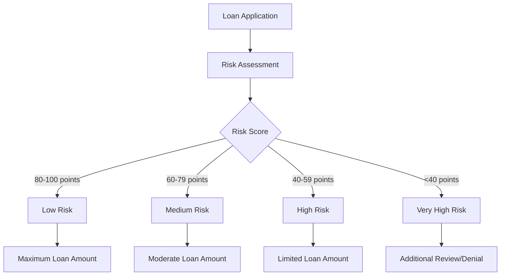

# Financial Organization App - Core Financial Logic

## Overview

This document explains the core financial calculations and business logic of the Financial Organization application, including how dividends, profits, shares, and loans interact within the system.

## Core Financial Components

### 1. Shares

Shares represent ownership in the organization. Each member can own a certain number of shares.

#### Share Calculation

- **Total Shares** = Sum of all shares owned by members
- **Share Value** = Total Organization Net Worth / Total Shares

### 2. Profits

Profits are calculated on a quarterly basis from the organization's income and expenses.

#### Profit Calculation

- **Quarterly Profit** = Total Income - Total Expenses
- **Annual Profit** = Sum of Quarterly Profits

### 3. Dividends

Dividends are portions of profit distributed to members of the organization.

#### Previous Dividend Calculation Model

- **Dividend Pool** = Quarterly Profit × Dividend Rate (e.g., 8.5%)
- **Per Member Dividend** = Dividend Pool / Number of Active Members

This was a simplification of the traditional dividend model where all active members received an equal share of the profits, regardless of their share ownership or contributions.

#### New Proportional Dividend Calculation

The system now implements a fully automated proportional dividend distribution model:

- **Dividend Rate** = Automatically calculated based on organization's total assets (higher assets → higher rate)
- **Dividend Pool** = Quarterly Profit × Dividend Rate 
- **Organization Total Assets** = Cash Contributions + Bank Balances + Outstanding Loans
- **Member's Asset Proportion** = Member's Total Assets / Organization Total Assets
- **Individual Dividend** = Dividend Pool × Member's Asset Proportion

This approach better rewards members based on their financial contributions to the organization. Members with higher contributions receive proportionally higher dividends, and the overall dividend rate adjusts dynamically based on the organization's financial health.

#### Dividend Rate Calculation Logic

The dividend rate is automatically determined using the following guidelines:
- Default rate: 8.5%
- For organizations with total assets > Rs. 1,000,000: 10.0%
- For organizations with total assets > Rs. 500,000: 9.0%
- For organizations with total assets < Rs. 100,000: 7.0%

This dynamic rate adjustment ensures that the organization remains financially stable while providing appropriate returns to members.

### 4. Loans

Loans are issued to members with interest, creating income for the organization.

#### Loan Calculation

- **Interest Amount** = Loan Principal × Interest Rate × Time Period
- **Monthly Payment** = (Principal + Total Interest) / Loan Term in Months
- **Total Repayment** = Principal + Total Interest

## Financial Workflows

### Quarterly Financial Cycle (Updated with Proportional Dividends)

### Loan Issuance and Repayment

## How These Components Affect Each Other

### 1. Members and Dividend Relationship

In the current implementation, all active members receive an equal portion of the dividend pool, which is calculated from the quarterly profit multiplied by the dividend rate.

### 2. Loans and Profit Relationship

Loan interest payments contribute to the organization's income, increasing quarterly profits. Higher profits lead to larger dividend pools.

### 3. Profit and Dividend Rate

The dividend rate (percentage of profit distributed to shareholders) affects how much profit is retained by the organization versus distributed to members.

### 4. System-Wide Financial Health

## Example Calculations

### Dividend Calculation Example (Previous Equal-Share Method)

Given:
- Quarterly Profit: Rs. 100,000
- Dividend Rate: 8.5%
- Number of Active Members: 20

Calculations:
1. Dividend Pool = Rs. 100,000 × 8.5% = Rs. 8,500
2. Dividend Per Member = Rs. 8,500 / 20 members = Rs. 425 per member

### Dividend Calculation Example (New Proportional Method)

Given:
- Quarterly Profit: Rs. 100,000
- Organization Total Assets: Rs. 1,000,000 (which determines the dividend rate)
- Member A Total Assets: Rs. 200,000
- Member B Total Assets: Rs. 50,000

Calculations:
1. Automatic Dividend Rate Determination: 
   - Since total assets are Rs. 1,000,000, the system selects 10.0% rate
2. Dividend Pool = Rs. 100,000 × 10.0% = Rs. 10,000
3. Member A Asset Proportion = Rs. 200,000 / Rs. 1,000,000 = 0.2 (20%)
4. Member B Asset Proportion = Rs. 50,000 / Rs. 1,000,000 = 0.05 (5%)
5. Member A Dividend = Rs. 10,000 × 0.2 = Rs. 2,000
6. Member B Dividend = Rs. 10,000 × 0.05 = Rs. 500

This proportional approach with automatic rate calculation ensures that members with higher financial contributions receive proportionally higher dividend payments, creating a more equitable system that incentivizes contribution to the organization's capital base.

### Loan Interest Calculation Example

Given:
- Loan Principal: Rs. 50,000
- Annual Interest Rate: 12%
- Loan Term: 12 months

Calculations:
1. Total Interest = Rs. 50,000 × 12% × 1 year = Rs. 6,000
2. Monthly Payment = Rs. 56,000 / 12 = Rs. 4,667 per month
3. Contribution to Income = Rs. 6,000 (over the life of the loan)

## Risk Management and Financial Safeguards

### 1. Loan Risk Assessment

The organization implements a systematic risk assessment for all loan applications:

#### Risk Scoring System
- **Member History Score**: Based on previous loan repayment history (0-40 points)
- **Financial Stability**: Based on income verification and existing financial obligations (0-30 points)
- **Contribution History**: Based on consistency of contributions to the organization (0-20 points)
- **Collateral/Security**: Additional security provided for the loan (0-10 points)

#### Loan Approval Thresholds
- **Low Risk (80-100 points)**: Eligible for maximum loan amounts at lowest interest rates
- **Medium Risk (60-79 points)**: Eligible for moderate loan amounts with standard interest rates
- **High Risk (40-59 points)**: Limited loan amounts with higher interest rates
- **Very High Risk (<40 points)**: Loan application subject to additional review or denial

### 2. Reserve Requirements

To ensure financial stability, the organization maintains the following reserve requirements:

- **Operational Reserve**: 15% of total assets must be kept as liquid funds for day-to-day operations
- **Contingency Reserve**: 10% of outstanding loan value is maintained for potential defaults
- **Growth Reserve**: 5% of quarterly profits are allocated for future expansion

#### Reserve Calculation Example

Given:
- Total Assets: Rs. 1,500,000
- Outstanding Loans: Rs. 800,000
- Quarterly Profit: Rs. 120,000

Calculations:
1. Operational Reserve = Rs. 1,500,000 × 15% = Rs. 225,000
2. Contingency Reserve = Rs. 800,000 × 10% = Rs. 80,000
3. Growth Reserve = Rs. 120,000 × 5% = Rs. 6,000
4. Total Required Reserves = Rs. 311,000

### 3. Dividend Enhancement Program

In addition to the standard dividend calculation, the system now includes a loyalty bonus component:

#### Loyalty Dividend Bonus
- **5+ Years Membership**: Additional 0.5% on personal dividend rate
- **10+ Years Membership**: Additional 1.0% on personal dividend rate
- **15+ Years Membership**: Additional 1.5% on personal dividend rate

This enhancement rewards long-term members for their continued participation and loyalty to the organization.

#### Enhanced Dividend Example

For a member with 12 years of active membership:
- Base Dividend: Rs. 2,000 (calculated using the proportional method)
- Loyalty Bonus: 1.0% additional rate
- Enhanced Dividend = Rs. 2,000 × (1 + 0.01) = Rs. 2,020

## Conclusion

The financial logic of this application creates a self-sustaining ecosystem where loan interest creates income, which generates profits, which are partially distributed as dividends to reward active membership. 

The proportional dividend distribution system directly links member rewards to their financial contributions. This creates stronger incentives for members to:

1. Increase their financial contributions to the organization
2. Maintain active membership status
3. Repay loans on time
4. Participate in the organization's growth

With the addition of risk management protocols, reserve requirements, and loyalty enhancements, the system now provides a more comprehensive financial framework that ensures long-term sustainability while rewarding member participation and commitment.

The organization's financial health is continuously monitored through automated quarterly assessments, which evaluate key metrics including:
- Loan-to-asset ratio
- Reserve adequacy
- Member contribution growth
- Operational cost efficiency

These assessments help guide strategic decision-making and ensure the continued financial stability of the organization. 